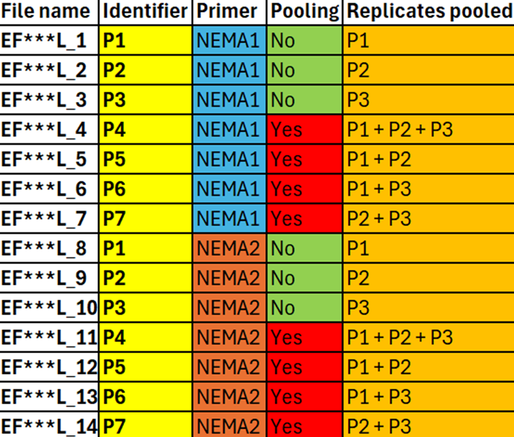

------------------------------------------------------------------------

title: "Sample assembly"

author: "Thomas Stocker"

date: "11-11-2024"

#if needed: bibliography: "references.bib"

------------------------------------------------------------------------

# **Welcome to the Sample assembly branch**

This branch deals with the assembly of the samples but also the automated renaming within R for both the species and or samples - this greatly saves time - instead of manual processing. But before we get into any coding, here is the brief description of the samples.

## **Samples:**

As discussed in the "Main" branch, the samples are labeled EF\*\*\*\_L1 to EF\*\*\*\_L14, with EF\*\*\* representing the cow's identifier, and the \_L1 to L14 denoting the primer used for amplification and the pooling method employed. This is visually explained in Supplementary figure 2 (below and in the "Main" branch").

### **Supplmentary figure 2 \|** **Sample identifiers and corresponding sample names:**



## **Loading the necessary libraries:**

For this branch the following libraries are required:\

```         
library(readxl)
library(dada2)
library(DECIPHER)
library(ShortRead)
library(Biostrings)
library(ggplot2)
library(stringr) 
library(readr)
library(tidyverse)
```

Now that the libraries have been loaded we can proceed into sample processing.

## **Sample processing and assigning taxonomy:**

This section of the branch involves the assembly of samples - assembling the read library and aligning it to a reference library through assignTaxonomy().
