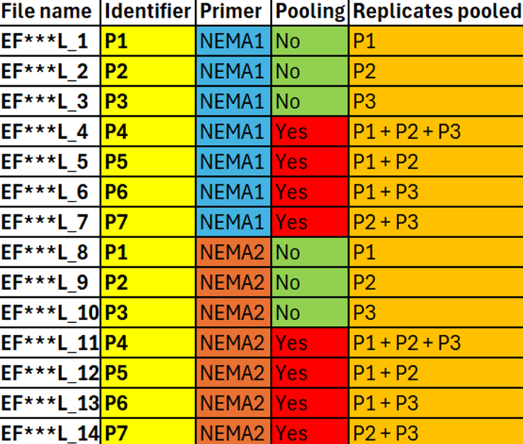

---

title: "Sample assembly"

author: "Thomas Stocker"

date: "11-11-2024"

bibliography: references.bib

---

# **Welcome to the sample assembly branch:**

**Welcome to the Sample assembly branch**

This branch deals with the assembly of the samples but also the automated renaming within R for both the species and or samples - this greatly saves time - instead of manual processing. But before we get into any coding, here is the brief description of the samples.

## **Samples:**

As discussed in the "Main" branch, the samples are labeled EF\*\*\*L-1 to EF\*\*\*L-14, with EF\*\*\* representing the cow's identifier, and the L-1 to L-14 denoting the primer used for amplification and the pooling method employed. This is visually explained in Supplementary figure 2 (below and in the "Main" branch").

### **Supplmentary figure 2 \|** **Sample identifiers and corresponding sample names:**



## **Loading the necessary libraries:**

For this branch the following libraries are required:\

```         
library(readxl)
library(dada2)
library(DECIPHER)
library(ShortRead)
library(Biostrings)
library(ggplot2)
library(stringr) 
library(readr)
library(tidyverse)
```

Now that the libraries have been loaded we can proceed into sample processing.

## **Sample processing and assigning taxonomy:**

This section of the branch involves the assembly of samples - assembling the read library and aligning it to a reference library through assignTaxonomy(). The first step involves loading the sequences into R, by calling path your folder with your sequences. Change "Nemabiome_sequences" to your file location for the sequences. The second piece of code involves identifying the forward and reverse reads, which are labelled here by the end of the file name.

```         
path <-"<path to sequence files>"

fwd_files <- sort(list.files(path, pattern = "R1", full.names = TRUE)) 
rev_files <- sort(list.files(path, pattern = "R2", full.names = TRUE))
```

Now we place all our names into vector so that the code knows what to look for: Then we apply said vector to the original files. Now our files have their proper names.

```         
# to cutsomise this code jist replace _ with whatever file name differentiating between forward and reverse. This code tells R to ignore the _R1/R2
samples = str_extract(basename(fwd_files), "^[^_]+")


names(fwd_files) <- samples
names(rev_files) <- samples
```

Now we move onto trimming of reads based on the primer binding sites, for this we used the forward NEMA1 primer and the reverse NEMA2 primer as these two primers allowed us to amplify ASVs that were identical for both primer sets (Supplementary figure 4). We then identified these primers in R, to adjust this to your dataset, just replace the fwd_primer/ rev_primer with the primers of interest.

```         
#NEMA1 Primer
fwd_primer <- "ACGTCTGGTTCAGGGTTGTT"
fwd_primer_rev <- as.character(reverseComplement(DNAStringSet(fwd_primer)))

# NEMA2 Primer
rev_primer <- "ATGCTTAAGTTCAGCGGGTA"
rev_primer_rev <- as.character(reverseComplement(DNAStringSet(rev_primer)))
```

### \***Supplementary figure 4 \| Primer binding sites for the rDNA of *Haemonchus contortus* (ON677958):**

The red arrows represents the NEMA1 primer and the blue arrows represent the NEMA2 primers. Due to the nested location of the primers we can amplify identical ASVs by trimming for the forward NEMA1 primer and the reverse NEMA2 primer.


We then count and trim the primers with the code below.

```         
# this is just a function to identify the number of primers present in the sequences - it does not need changing.

count_primers <- function(primer, filename) {
  num_hits <- vcountPattern(primer, sread(readFastq(filename)), fixed = FALSE)
  return(sum(num_hits > 0))
}

# this will tell us how many primers are there:
count_primers(fwd_primer, fwd_files[[1]])
count_primers(rev_primer, rev_files[[1]])

cutadapt <- path.expand("<path to your cutadapt location>/cutadapt.exe")

# Make sure it works
system2(cutadapt, args = "--version")
# this will tell you the version and serves as an assurance to know it succesfully loaded. 

# this requires no editing:
cut_dir <- file.path(path, "cutadapt")
if (!dir.exists(cut_dir)) dir.create(cut_dir)

fwd_cut <- file.path(cut_dir, basename(fwd_files))
rev_cut <- file.path(cut_dir, basename(rev_files))

names(fwd_cut) <- samples
names(rev_cut) <- samples

# this just creates log files which is good practice.
cut_logs <- path.expand(file.path(cut_dir, paste0(samples, ".log")))

# this trims the forward and reverse primers and discards any untrimmed reads since they are most likely sequencing errors without primer binding sites!
cutadapt_args <- c("-g", fwd_primer, "-a", rev_primer_rev, 
                   "-G", rev_primer, "-A", fwd_primer_rev,
                   "-n", 2, "--discard-untrimmed")

# this applies cutadapt to our samples - no need for editing!
for (i in seq_along(fwd_files)) {
  system2(cutadapt, 
          args = c(cutadapt_args1,
                   "-o", fwd_cut[i], "-p", rev_cut[i], 
                   fwd_files[i], rev_files[i]),
          stdout = cut_logs[i])  }

# this tells us if we got a result!
head(list.files(cut_dir))
tail(list.files(cut_dir))

dir(path="<path to cutadapt>/cutadapt") 
```

The next step is to do quality control on the reads. Since removing reads with less than 200bp can reduce the error rates @pfeifferSystematicEvaluationError2018, we decided to remove any reads below 200bp, through the function truncLen=c(200, 200). This can be changed to any desired number as long as there is enough base pairs left to produce an overlap.

```         
plotQualityProfile(fwd_cut[3:4]) + ggtitle("Forward")

plotQualityProfile(rev_cut[3:4]) + ggtitle("Reverse")

 # Same as for the cutting we create an output directory to store the filtered files
filt_dir <- file.path(path, "filtered")
if (!dir.exists(filt_dir)) dir.create(filt_dir)

fwd_filt <- file.path(filt_dir, basename(fwd_files))
rev_filt <- file.path(filt_dir, basename(rev_files))

names(fwd_filt) <- samples
names(rev_filt) <- samples

# everything is default apart from the truncLen=c(200, 200) which says that the forward and reverse reads get truncated at 200bp and anything below that is discarded:
filtered_out <- filterAndTrim(
  fwd = fwd_cut, 
  filt = fwd_filt,
  rev = rev_cut,
  filt.rev = rev_filt,
  maxEE = c(2, 5), 
  truncQ = 2, 
  rm.phix = TRUE, 
  compress = TRUE, 
  multithread = FALSE, truncLen=c(200,200)
  )  
```
