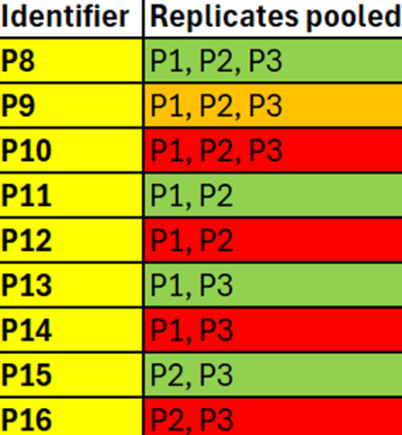

This repository provides an in-depth explanation of the experimental design, coding and an easy to follow guide on the analysis of nested and non-nested amplicon metabarcoding data. This repository relates to the work published by Stocker et al... which can be found in: LINK TO STUDY WHEN PUBLISHED We kindly request that if this code is to be used that you please cite this article. The code is an accumulation of two years of hard work!

## 

# Experimental design

This study examined the effects of various variables - both bioinformatic and laboratory based variables. All bioinformatic methods are applied to the amplicon sequence variants (ASVs) Laboratory based variables were: the cow sampled (C13 - C17), primer chosen (NEMA1 and NEMA2) and the choice of pooling method (P1 - P3 are replicates, P4 - P7 are laboratory pooled replicates). Bioinformatic variables include: pooling method (P8 - P16 are bioinformatically pooled), copy thresholds (removing ASVs with 1 read, 5, 100, 500 reads or less of the total reads), proportion-based thresholds (removing ASVs with 0.05%, 0.5%, 1%, 2% or less of the total reads) and sequencing depth (removing samples with less than 2,000, 5,000, 10,000 and 25,000 reads, samples with more reads the thresholds are rarefied). The experimental design is explained visually in Supplementary figure 1. All methods will be described in further detail below.

#### **Supplementary figure 1 \| Experimental design of the study visually explained:**

All treatments are nested for every possible treatment combination.

### 

# Laboratory methods:

All five cows were amplified in three replicates (P1 - P3), using two primer sets, the NEMA1 primer set (NC-1/ NC-2) and NEMA2 primer set (Strongyl_ITS-2_F/ Strongylid_ITS-2_R). The three replicates were manually pooled into P4 - P7 for all possible combinations. The sample identifiers from all laboratory methods (cow sampled, pooling method and primer used) and their corresponding sample names are presented in Supplementary figure 2. ADD MORE DETAILS WHEN GET THEM FROM JAN AND EMILY!!!

#### **Supplementary figure 2 \| Sample identifiers and corresponding sample names:**

The file name for the fasta files are present in the first column, The \*\*\* denotes the sample number, with EF013 being C13, all the way to EF017 being C17. Identifier signifies the sample identifier for the pooling method.

### 

### 

# Bioinformatic preparations:

Following the sequencing and assembly of all samples, we bioinformatically pooled all the replicates for all possible combinations. The pooling identifier and corresponding sample variable is presented in Supplementary figure 3.

#### **Supplementary figure 3 \| Bioinformatic pooling sample identifiers:** 

identifier signifies the sample identifier for the pooling method

We then applied copy thresholds, whereby the raw reads were removed if they were equal or less than 1 read, 5 reads, 100 reads or 500 reads. The ASVs were then converted into proportions of the sample reads library to ensure that the different read library sizes did not interfere with the statistical analyses.

We repeated the above steps with the proportion-based thresholds - for raw reads constituting less than or equal to 0.05%, 0.5%, 1%, 2%. After analyses the data was normalised through conversion to a percentage for the total reads of the sample library.

We subsampled the raw data randomly over numerous iterations to produce a rarefied dataset. The size of the total rarefied datasets are equal to 2,000, 5,000, 10,000 and 25,000 reads. The resulting datasets were nromalised into percentages.

The bioinformatic workflow is incorporated into numerous branches. All of the sample assembly steps are included in the branch "Sample assembly", the bioinformatic pooling is in "Bioinformatic pooling", the application of thresholds is in "Application of thresholds" and rarefaction in "Rarefying the data". The rarefied data is interchangeably referred to as sequencing depth.

# Analyses of the data:

A thorough account of the analyses, the justification and the reproducible/ easy to modify open access code is available in the branches "ASV level threshold analyses", "Species level threshold analyses" and "Sequencing depth analyses". Briefly included analyses are: nested ASV/ species richness box plots, ASV relative abundance

# spare graphs - included in body of text: 

